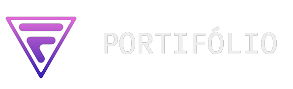

<div align="center" id="top"> 
  

  &#xa0;

  # <a href="https://portifolio-fernando.onrender.com" target="_blank">Site</a>
</div>

<h1 align="center">Portifolio</h1>

<p align="center">
  

  

  

  
</p>


<p align="center">
  <a href="#dart-about">About</a> &#xa0; | &#xa0; 
  <a href="#rocket-technologies">Technologies</a> &#xa0; | &#xa0;
  <a href="#white_check_mark-requirements">Requirements</a> &#xa0; | &#xa0;
  <a href="#checkered_flag-starting">Starting</a> &#xa0; | &#xa0;
  <a href="#memo-license">License</a> &#xa0; | &#xa0;
  <a href="https://github.com/fernando-juni0" target="_blank">Author</a>
</p>

<br>
<hr>

<h1 align="center">🔖 Status</h1>
<h4 align="center">🚧  Portifolio in Beta..  🚧</h4> 

<hr>
<br>

## :dart: About ##

Hello, this application is a portfolio developed 100% by me (Fernando Júnio), the application aims to show a little of my work, in the application it is possible to find several features in addition to delivering a vision of my person, I hope you like it ♡.

## :rocket: Technologies ##

The following tools were used in this project:

- [Node.js](https://nodejs.org/en/)
- [EJS](https://ejs.co)
- [CSS](https://developer.mozilla.org/pt-BR/docs/Web/CSS)
- [JavaScript](https://developer.mozilla.org/pt-BR/docs/Web/JavaScript)

## :white_check_mark: Requirements ##

Before starting :checkered_flag:, you need to have [Git](https://git-scm.com) and [Node](https://nodejs.org/en/) installed.

## :checkered_flag: Starting ##

```bash
# Clone this project
$ git clone https://github.com/fernando-juni0/portifolio

# Access
$ cd portifolio

# Install dependencies
$ npm install

# Run the project
$ npm start

# The server will initialize in the <http://localhost:80>

#It is possible to change the opening port of the server by creating a .ENV file and adding the following line: PORT='Your Port'
```

## :memo: License ##

This project is under license from MIT. For more details, see the [LICENSE](LICENSE.md) file.


Made with :heart: by <a href="https://github.com/fernando-juni0" target="_blank">Fernando Júnio</a>

&#xa0;

<a href="#top">Back to top</a>
